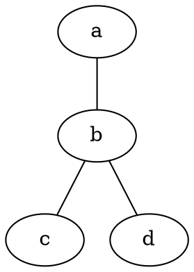
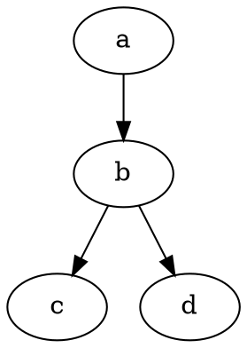

# Часть 1. Обход графа в глубину и в ширину

- [ ] Библиотека должна быть написана на языке C    
- [ ] Код библиотеки должен находиться в папке `src` в ветке `develop`
- [ ] При написании программы используйте стандартный для выбранного языка стиль написания кода
- [ ] В этом и последующих заданиях считайте, что нумерация вершин начинается с 1
      
## Реализуйте библиотеку s21_graph:

- [x]  Оформите решение как статическую библиотеку (`s21_graph`)
      
- [x] Библиотека должна быть представлена в виде класса `graph`, который хранит информацию о графе с помощью **матрицы смежности**. Размерность матрицы смежности должна задаваться динамически при инициализации графа (при его загрузке из файла).
- [x] Сборка программы должна быть настроена с помощью `Makefile` со стандартным набором целей для программ `GNU: all, clean, test, s21_graph`.
- [ ] Обеспечьте полное покрытие модульными тестами методов класса graph.
- [ ] Класс graph должен содержать как минимум следующие общедоступные методы:  
> `load_graph_from_file(char *filename)` — загрузка графа из файла в формате матрицы смежности  
> `export_graph_to_dot(char *filename)` — выгрузка графа в файл в формате dot (см. материалы)

 Граф, описанный на языке DOT 
 
	
, обычно представляет собой текстовый файл с расширением `.gv` или `.dot` в формате, понятном для человека и обрабатывающей программы.

В графическом виде графы, описанные на языке `DOT`, представляются с помощью специальных программ, например, **Graphviz**.

## Пример неориентированного графа, заданного на языке DOT

Неориентированный граф в языке DOT описывается списком вершин и рёбер, представленных названием вершин и двойным тире (--) между связанными вершинами.

Или эквивалентным образом, опустив избыточные описания:

## Пример ориентированного графа, заданного на языке DOT

Ориентированный граф в языке DOT описывается списком вершин и рёбер, представленных названием вершин и стилизованной тире и треугольной скобкой — стрелочкой (->), между связанными вершинами:

Либо с избыточным описанием:

## Реализуйте библиотеку s21_graph_algorithms:

- [ ] Оформите решение как статическую библиотеку (`s21_graph_algorithms`).
- [ ] Библиотека должна быть представлена в виде класса `graph_algorithms`, который будет содержать реализацию алгоритмов на графах. При этом сам класс `graph_algorithms` не должен ничего знать о внутреннем представлении графа в классе `graph`. Для взаимодействия с данными графа класс `graph_algorithms` может использовать только общедоступные методы и свойства, предоставляемые классом `graph`.
- [x] Добавьте в `Makefile` цель `s21_graph_algorithms`  
- [ ] Обеспечьте полное покрытие модульными тестами методов класса `graph_algorithms`.
- [ ] Класс `graph_algorithms` должен содержать как минимум следующие общедоступные методы:
> `depth_first_search(graph *graph, int start_vertex)` — нерекурсивный поиск в глубину в графе от заданной вершины. Функция должна возвращать массив, содержащий пройденные вершины в порядке их обхода. При реализации этой функции обязательно используйте самописную структуру данных стек, которую предварительно стоит оформить в виде отдельной статической библиотеки  
> `breadth_first_search(graph *graph, int start_vertex)` — поиск в ширину в графе, начинающийся с заданной вершины. Функция должна возвращать массив, содержащий пройденные вершины в порядке их обхода. При реализации этой функции обязательно используйте самописную структуру данных очередь, которую предварительно стоит оформить в виде отдельной статической библиотеки  
- [ ] Необходимо адаптировать ранее созданные самописные вспомогательные классы `stack` и `queue` (для этого можно использовать своё решение из проекта **CPP2**) и реализовать для них интерфейсы на **C**. Эти классы должны содержать следующие методы:
> `stack()` — создание пустого стека  
> `queue()` — создание пустой очереди  
> `push(value)` — добавление элемента в стек/очередь  
> `pop()` — получение элемента из стека/очереди с последующим удалением из стека/очереди  
> `top()` — получение элемента из стека без его удаления из стека  
> `front()` — получение первого элемента из очереди без его удаления из очереди  
> `back()` — получение последнего элемента из очереди без его удаления из очереди  

# Часть 2. Поиск кратчайших путей в графе

Добавь в класс `graph_algorithms` два новых метода:

> `get_shortest_path_between_vertices(graph *graph, int vertex1, int vertex2)` — поиск кратчайшего пути между двумя вершинами в графе с использованием алгоритма Дейкстры. Функция принимает на вход номера двух вершин и возвращает численный результат, равный наименьшему расстоянию между ними.

> `get_shortest_paths_between_all_vertices(graph *graph)` — поиск кратчайших путей между всеми парами вершин в графе с использованием алгоритма Флойда-Уоршелла. В качестве результата функция возвращает матрицу кратчайших путей между всеми вершинами графа.

# Часть 3. Поиск минимального остовного дерева

Добавь в класс `graph_algorithms` новый метод:

> `get_least_spanning_tree(graph *graph`) — поиск наименьшего остовного дерева в графе с помощью алгоритма Прима. В качестве результата функция должна возвращать матрицу смежности для минимального остовного дерева.

# Часть 5. Консольный интерфейс

Тебе необходимо написать основную программу, представляющую собой консольное приложение для проверки работоспособности реализованных библиотек `s21_graph` и `s21_graph_algorithms`  
Консольный интерфейс обязательно должен покрывать следующий функционал:

- [x] Загрузка исходного графа из файла.
- [ ] Обход графа в ширину с выводом результата обхода в консоль.
- [x] Обход графа в глубину с выводом результата обхода в консоль.
- [x] Поиск кратчайшего пути между произвольными двумя вершинами с выводом результата в консоль.
- [x] Поиск кратчайших путей между всеми парами вершин в графе с выводом результирующей матрицы в консоль.
- [ ] Поиск минимального остовного дерева в графе с выводом результирующей матрицы смежности в консоль.
- [ ] Решение задачи коммивояжера с выводом результирующего маршрута и его длины в консоль.
