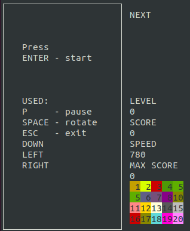
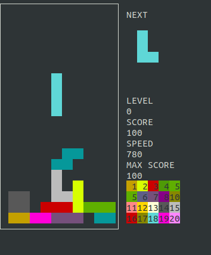
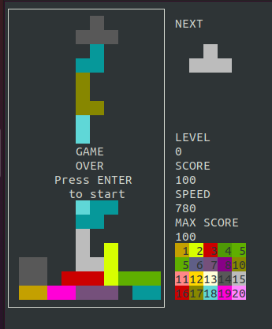
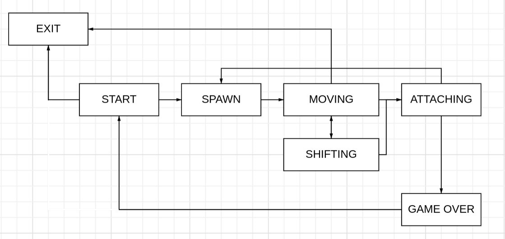

# TETRIS
## Установка Tetris BrickGame 
Скачать и распаковать архив `lymondka.tetris.tar.gz`  
В терминале выполнить команду `make`  
При установке будет показано куда будет установлена игра, а так же можно запустить игру проверить ее работу  

## Управление Tetris BrickGame
Enter - Начало игры;  
p - Пауза 
### Движение  
right, down, left  
Space - вращение фигуры
### Выход  
Esc key - Завершение игры 

## Пример работы Tetris BrickGame
  
    
  

## Описание прокета Tetris BrickGame
- Программа разработана на языке `С` стандарта `C11` с использованием компилятора `gcc`.

- Для формализации логики игры использован конечный автомат.  
  
  
- В игре присутствовуют все виды фигур, показанные на картинке ниже  
         
  -  Игровое поле соответствовует размерам игрового поля консоли: 10 «пикселей» в ширину и 20 «пикселей» в высоту.
- В игре присутвуют следующие механики:
  - [x] Вращение фигур;  
  - [x] Перемещение фигуры по горизонтали;  
  - [x] Ускорение падения фигуры (при нажатии кнопки фигура перемещается до конца вниз);  
  - [x] Показ следующей фигуры;  
  - [x] Уничтожение заполненных линий;  
  - [x] Завершение игры при достижении верхней границы игрового поля;  
  - [x] Фигура после достижения нижней границы поля или соприкосновения с другой фигурой останавливается. Вслед за этим происходит генерация следующей фигуры, показанной на превью;  
  - [x] подсчет очков и хранение максимального количества очков;  
  - [x]  Максимальное количество очков изменяться во время игры, если пользователь превышает текущий показатель максимального количества очков во время игры
  - [x]  Начисление очков будет происходить следующим образом:
      - 1 линия — 100 очков;
      - 2 линии — 300 очков;
      - 3 линии — 700 очков;
      - 4 линии — 1500 очков;
  - [x] Каждый раз, когда игрок набирает 600 очков, уровень увеличивается на 1;   
  - [x] Повышение уровня увеличивает скорость движения фигур;  
  - [x] Максимальное количество уровней — 10;   
  
-  Код библиотеки реализующей логику игры тетрис находиться в папке `src/brick_game/tetris`  
-  Код с терминальным интерфейсом с использованием библиотеки `ncurses` находиться в папке `src/gui/cli`
-  Код конечного автомата описан в файле `src/fsm.c` 
- Сборка программы настроена с помощью `makefile` со стандартным набором целей для `GNU`-программ:
  - [x] all
  - [x] install
  - [x] uninstall
  - [x] clean
  - [x] dvi
  - [x] dist
  - [x] test
  - [x] gcov_report -покрытие библиотеки `unit`-тестами с помощью библиотеки `check` 
  - [x] Установка ведется в любой произвольный каталог  заданный в `makefile` переменной `DIR_GAME`
      
- Дополнительные цели:
    - [x] tetris - запускает поочередную компиляцию файлов
    - [x] out/%.o: %.c - компилируется подаваемый файл из цели tetris
    - [x] mkdir - создание дополнительных каталогов для компиляции программы
    - [x] test_file - компиляция файлов для прогонки тестов
    - [x] test - запуск тестовых сценариев
    - [x] valgrind  
    - [x] cppcheck
    - [x] clang_n
    - [x] clang_i
          

