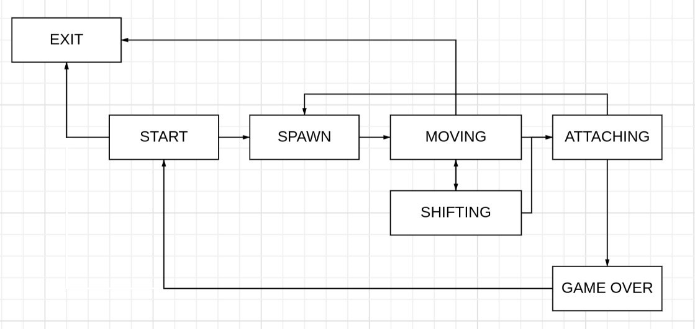

# TETRIS
## Управление
p - поставить игру на паузу  
Enter - начать новую игру
### Движение
right, down, left, Space
### Выход
Esc key
## Установка 
```git clone XXX && cd s21_tetris && make install```
## Сборка
```make tetris``` makes switch-case realisation of fsm which you can observe in file src/fsm.c \
```make tetris_fsmtable``` makes fsm realisation based on matrix of pointers on state-control functions which you can observe in file src/fsm_matrix.c

# Спецификация для библиотеки игры из коллекции игр BrickGame

Это задание является первым из серии BrickGame. Всего будет четыре проекта, в каждом — своя игра и свои технологии. Но помимо разработки новых проектов, необходимо будет поддерживать и старые игры, и добавлять поддержку новых игр в старые проекты. ... Для того чтобы поддерживать старые и новые игры, необходимо заранее определиться, как будет устроено АПИ интерфейсов и библиотек, чтобы в дальнейшем не приходилось переписывать уже сданные проекты.

**Игровое поле** представляется, как матрица размерностью 10 на 20. Каждый элемент матрицы соответствует «пикселю» игрового поля и может находиться в одном из двух состояний: пустой и заполненный. Кроме игрового поля, у каждой игры есть дополнительная информация, которая выводится в боковой панели справа от игрового поля. Для дополнительной информации, не используемой во время игры, следует предусмотреть заглушки.

Каждая библиотека с игрой должна иметь функцию, принимающую на вход пользовательский ввод. У консоли имеется восемь физических кнопок: начало игры(`Enter`), пауза(`p`), завершение игры(`esc`), действие(`space`) и четыре стрелочки.

Функция `userInput` принимает на вход пользовательское действие `action` и дополнительный параметр `hold`, который отвечает за зажатие клавиши.

Функция `updateCurrentState` предназначена для получения данных для отрисовки в интерфейсе. Она возвращает структуру, содержащую информацию о текущем состоянии игры. Например, для тетриса истечение таймера приводит к смещению фигуры вниз на один ряд. Эта функция должна вызываться из интерфейса с некоторой периодичностью для поддержания интерфейса в актуальном состоянии.

```c
typedef enum {
    Start,
    Pause,
    Terminate,
    Left,
    Right,
    Up,
    Down,
    Action
} UserAction_t;

typedef struct {
    int **field;
    int **next;
    int score;
    int high_score;
    int level;
    int speed;
    int pause;
} GameInfo_t;

void userInput(UserAction_t action, bool hold);

GameInfo_t updateCurrentState();
```

Обрати внимание, что информация о текущем состоянии игры `GameInfo_t` может быть представлена внутри библиотеки игры статическим объектом.

## Требования к проекту

### Часть 1. Основное задание

Тебе необходимо реализовать программу `BrickGame v1.0 aka Tetris`:

- Программа должна быть разработана на языке `С` стандарта `C11` с использованием компилятора `gcc`.
- Программа должна состоять из двух частей: библиотеки, реализующей логику игры тетрис, и терминального интерфейса с использованием библиотеки `ncurses`.
- Для формализации логики игры должен быть использован конечный автомат.  
  
- Библиотека должна иметь функцию, принимающую на вход ввод пользователя, и функцию, выдающую матрицу, которая описывает текущее состояние игрового поля при каждом ее изменении  
- [x] Код библиотеки программы должен находиться в папке `src/brick_game/tetris`  
- [x] Код с интерфейсом программы должен находиться в папке `src/gui/cli`  
- Сборка программы должна быть настроена с помощью `Makefile` со стандартным набором целей для `GNU`-программ:
- [x] all
- [x] install
- [x] uninstall
- [x] clean
- [ ] dvi, dist
- [x] test
- [x] gcov_report
- [x] Установка должна вестись в любой другой произвольный каталог  
- Программа должна быть разработана в соответствии с принципами структурного программирования 
- При написании кода придерживайся Google Style 
- Должно быть обеспечено покрытие библиотеки `unit`-тестами с помощью библиотеки `check` (тесты должны проходить на ОС `Darwin/Ubuntu`). Покрытие библиотеки с логикой игры тестами должно составлять не меньше `80 процентов`  
- В игре должны присутствовать следующие механики:
  - [x] Вращение фигур;  
  - [x] Перемещение фигуры по горизонтали;  
  - [x] Ускорение падения фигуры (при нажатии кнопки фигура перемещается до конца вниз);  
  - [x] Показ следующей фигуры;  
  - [x] Уничтожение заполненных линий;  
  - [x] Завершение игры при достижении верхней границы игрового поля;  
  - [x] В игре должны присутствовать все виды фигур, показанные на картинке ниже
         
- Для управления добавь поддержку всех кнопок, предусмотренных на физической консоли:  
 - [x] Начало игры,  
 - [x] Пауза,  
 - [x] Завершение игры,  
-  [x] Стрелка влево — движение фигуры влево,  
-  [x] Стрелка вправо — движение фигуры вправо,  
-  [x] Стрелка вниз — падение фигуры,  
 - [x] Стрелка вверх — не используется в данной игре,  
 - [x] Действие (вращение фигуры).  
- [x] Игровое поле должно соответствовать размерам игрового поля консоли: 10 «пикселей» в ширину и 20 «пикселей» в высоту.  
- [x] Фигура после достижения нижней границы поля или соприкосновения с другой фигурой должна остановиться. Вслед за этим происходит генерация следующей фигуры, показанной на превью.
- Интерфейс библиотеки должен соответствовать описанию, которое находится выше
- [x] Пользовательский интерфейс должен поддерживать отрисовку игрового поля и дополнительной информации.
- Подготовь в любом формате диаграмму, описывающую используемый КА (его состояния и все возможные переходы).

### Часть 2. Дополнительно. Подсчет очков и рекорд в игре

Добавь в игру следующие механики:

- [x] подсчет очков;  
- [x] хранение максимального количества очков.  

Данная информация должна передаваться и выводиться пользовательским интерфейсом в боковой панели. Максимальное количество очков должно храниться в файле или встраиваемой СУБД и сохраняться между запусками программы.

- [x] Максимальное количество очков должно изменяться во время игры, если пользователь превышает текущий показатель максимального количества очков во время игры.

Начисление очков будет происходить следующим образом:

- 1 линия — 100 очков;
- 2 линии — 300 очков;
- 3 линии — 700 очков;
- 4 линии — 1500 очков.

### Часть 3. Дополнительно. Механика уровней

Добавь в игру механику уровней.   
- [x] Каждый раз, когда игрок набирает 600 очков, уровень увеличивается на 1.  
- [x] Повышение уровня увеличивает скорость движения фигур.  
- [x] Максимальное количество уровней — 10. 

___

На проекте тебе предстоит пройти код-ревью проверку — не забудь изучить инструкцию для прохождения и проведения код-ревью по [ссылке](https://applicant.21-school.ru/code_review).
